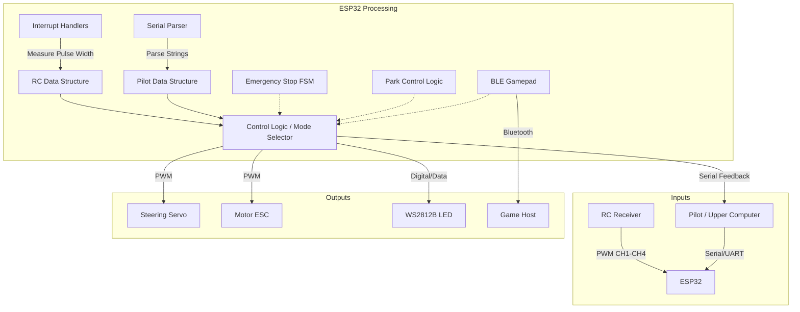
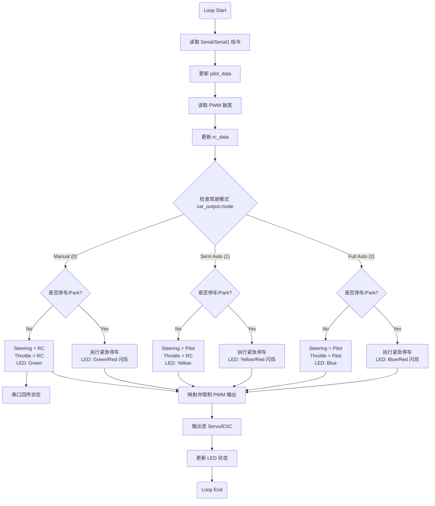
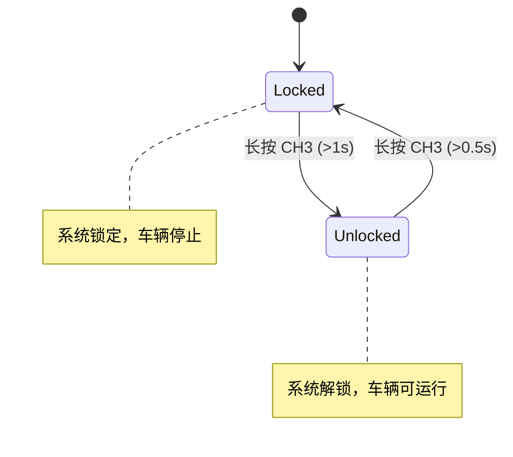

# MUS4 程序架构文档

本文档详细说明 `mus4.ino` 程序的运行逻辑、系统架构及关键模块。

## 1. 系统概览

`mus4.ino` 是基于 ESP32 的自动驾驶小车底层控制程序（MUS4-v2.3 PCB 版本）。它主要负责：
1.  **信号采集**：接收 RC 遥控器的 PWM 信号和上位机（Pilot）的串口指令。
2.  **控制决策**：根据当前驾驶模式（手动/半自动/自动）融合控制信号。
3.  **执行输出**：控制舵机（转向）和电调（油门），并驱动 LED 显示系统状态。
4.  **安全机制**：包含紧急停车（Emergency Stop）状态机和停车/解锁（Park）控制。
5.  **蓝牙手柄**：支持 BLE Gamepad 模式，将 RC 信号转换为蓝牙手柄输入。

## 2. 系统架构

下图展示了系统的硬件抽象及数据流向：



## 3. 核心数据结构

程序定义了 `struct_message` 结构体用于统一管理控制数据：

```cpp
struct struct_message {
    int throttle; // 油门值 (-100 ~ 100)
    int steering; // 转向值 (-100 ~ 100)
    int mode;     // 驾驶模式
    bool park;    // 停车标志
};
```

主要实例包括：
*   `rc_data`: 存储来自 RC 接收机的处理后数据。
*   `pilot_data`: 存储来自上位机的指令。
*   `car_output`: 最终计算出的输出控制量。
*   `esp_now_data`: ESP-NOW 通信数据（当前版本已禁用）。

## 4. 运行逻辑

主循环 `loop()` 是程序的核心，其处理流程如下：

### 4.1 逻辑流程图



### 4.2 驾驶模式说明

| 模式 ID | 宏定义 | 名称 | 说明 | 控制权分配 | LED 颜色 |
| :--- | :--- | :--- | :--- | :--- | :--- |
| 0 | `CAR_MODE_MANUAL` | 手动模式 | 完全由遥控器控制 | 转向: RC, 油门: RC | 绿色 (Green) |
| 1 | `CAR_MODE_SEMI_AUTO` | 半自动模式 | 自动转向，人工控制油门 | 转向: Pilot, 油门: RC | 黄色 (Yellow) |
| 2 | `CAR_MODE_FULL_AUTO` | 自动驾驶模式 | 完全由上位机控制 | 转向: Pilot, 油门: Pilot | 蓝色 (Blue) |

## 5. 紧急停车机制 (Emergency Stop)

当触发停车信号（`park == 1`）时，系统进入紧急停车状态机。

### 5.1 状态机逻辑

```mermaid
stateDiagram-v2
    [*] --> EST_IDLE
    
    EST_IDLE --> EST_READY : 触发停车且当前有油门
    EST_IDLE --> EST_DONE : 触发停车且当前无油门
    
    state EST_READY {
        [*] --> WaitReady
        WaitReady --> SetBrake : 经过 500ms
        note right of WaitReady : 缓冲期，油门设为 15
    }

    EST_READY --> EST_BRAKING : 准备完成
    
    state EST_BRAKING {
        [*] --> Braking
        Braking --> BrakeDone : 经过 1500ms
        note right of Braking : 全力刹车，油门设为 -100
    }

    EST_BRAKING --> EST_DONE : 刹车完成
    
    state EST_DONE {
        note right of EST_DONE : 停车完成，油门归零
    }
    
    EST_DONE --> EST_IDLE : 解除停车信号
```

### 5.2 状态说明

| 状态 | 说明 | 持续时间 | 油门输出 |
|------|------|----------|----------|
| EST_IDLE | 空闲状态，准备接收停车指令 | - | 当前值 |
| EST_READY | 准备刹车，缓冲阶段 | 500ms | 15（小油门） |
| EST_BRAKING | 全力刹车 | 1500ms | -100（最大刹车） |
| EST_DONE | 刹车完成 | - | 0 |

## 6. 停车/解锁控制 (Park Control)

通过 RC 接收机的 CH3 通道（`CH_PARK`）控制系统的停车/解锁状态。

### 6.1 操作逻辑

- **锁定（进入停车模式）**：按住按钮 0.5 秒
- **解锁（退出停车模式）**：按住按钮 1 秒

### 6.2 状态转换



## 7. 信号输入与中断

*   **PWM 输入**：使用 ESP32 的 `attachInterrupt` 监听 4 个通道的引脚电平变化。
    *   上升沿记录时间戳 `rise_time`。
    *   下降沿计算脉宽 `pwm_value = micros() - rise_time`。
*   **串口输入**：
    *   `Serial` (USB) 和 `Serial1` (RS232) 均监听格式为 `Throttle:Steering\n` 的字符串（例如 `10:20\n`）。
    *   解析后更新 `pilot_data`。

## 8. 输出映射

*   **PWM 生成**：计算出的 `car_output` (-100 ~ 100) 被映射到舵机和电调的脉宽范围。
    *   **Steering**: `SERVO_MID` (1250) ± `SERVO_RANGE` (440)
    *   **Throttle**: `MOTOR_MID` (1229) ± `MOTOR_RANGE` (390)
*   使用 `ledc` 库生成 PWM 信号，频率 50Hz，分辨率 14bit。

## 9. 蓝牙手柄模式 (BLE Gamepad)

当启用 `ENABLE_GAMEPAD_MODE` 时，程序会将 RC 接收机的信号转换为蓝牙手柄输入。

### 9.1 映射关系

| RC 通道 | 手柄轴 | 映射范围 |
|---------|--------|----------|
| CH1 (转向) | Right Thumb X | 1000-2000 → 0-32767 |
| CH2 (油门) | Left Thumb Y | 1300-1800 → 32767-0 |

### 9.2 使用场景

用于将 RC 遥控器作为蓝牙游戏手柄连接到 PC 或其他设备，实现无线控制模拟器或其他应用。

## 10. LED 状态指示

系统使用 WS2812B RGB LED 显示当前状态：

| 状态 | LED 颜色 | 说明 |
|------|----------|------|
| 手动模式 | 绿色 | 车辆由 RC 遥控器控制 |
| 半自动模式 | 黄色 | 自动转向，RC 控制油门 |
| 自动驾驶模式 | 蓝色 | 完全由上位机控制 |
| 紧急停车 | 双色闪烁 | 当前模式颜色 + 红色闪烁 |
| 初始化 | 蓝色 | 系统启动时显示 |

## 11. 关键常量与配置

| 常量 | 值 | 说明 |
|------|-----|------|
| `PWM_MIN` | 819 | PWM 最小计数值 |
| `PWM_MAX` | 1638 | PWM 最大计数值 |
| `MOTOR_MID` | 1229 | 电机中位值 |
| `MOTOR_RANGE` | 390 | 电机控制范围 |
| `SERVO_MID` | 1250 | 舵机中位值 |
| `SERVO_RANGE` | 440 | 舵机控制范围 |
| `BUAD_RATE_0` | 115200 | USB 串口波特率 |
| `BUAD_RATE_1` | 115200 | RS232 串口波特率 |
| `toggleInterval` | 250ms | LED 闪烁间隔 |

---
*文档版本：v2.3*
*基于固件版本：MUS4-v2.3 PCB*
*更新日期：2026-03-08*
