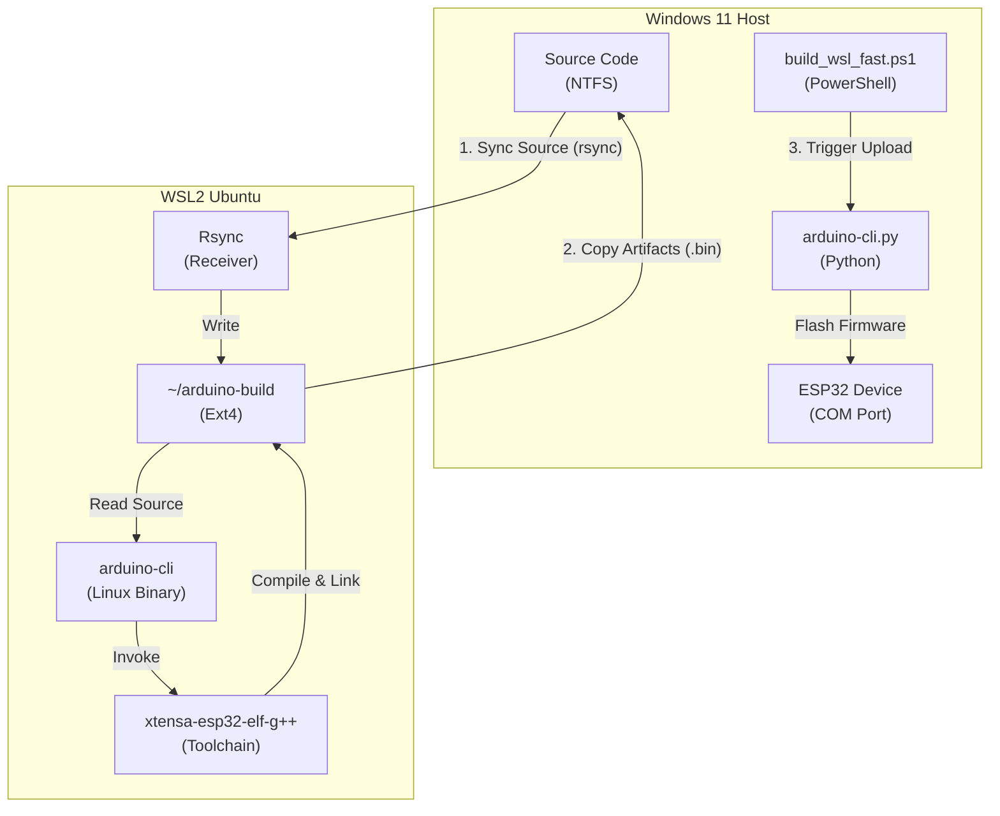

# WSL 高速构建脚本技术文档

## 1. 简介

`build_wsl_fast.ps1` 是一个专为解决 Windows 下 WSL2 编译 Arduino/ESP32 项目 I/O 性能瓶颈而设计的 PowerShell 自动化脚本。通过将源码同步到 WSL 原生文件系统进行编译，再将产物回传，实现了比直接挂载编译快 5 倍以上的构建速度。

### 核心功能

*   **全自动同步**: 自动检测增量变更，通过 `rsync` 将 Windows 源码同步到 WSL。
*   **原生编译**: 在 WSL 的 Ext4 文件系统上执行 `arduino-cli` 编译，利用 Linux 内核高速 I/O。
*   **产物回传**: 仅回传编译生成的 `.bin` 和 `.elf` 文件，保持 Windows 端工作流兼容。
*   **无缝集成**: 自动调用 Windows 端的 `arduino-cli.py` 完成固件上传和串口复位。
*   **可视化反馈**: 提供 Braille Spinner 进度动画和精确到毫秒的耗时统计。

---

## 2. 系统架构与数据流

### 架构图



### 关键数据流

1.  **同步阶段 (Windows -> WSL)**:
    *   **工具**: `wsl.exe` 调用 Linux 端 `rsync`。
    *   **路径**: `/mnt/c/Dev/DDC/mus4/` -> `~/arduino-build/mus4/`。
    *   **策略**: 增量同步，排除 `.git`, `.venv`, `build_wsl` 等无关目录。

2.  **编译阶段 (WSL Internal)**:
    *   **工具**: Linux 版 `arduino-cli`。
    *   **路径**: 所有中间文件 (`.o`, `.d`, `.a`) 均生成在 `~/arduino-build/mus4/build_wsl` (Ext4)。
    *   **优势**: 避免了 9P 协议跨文件系统的开销。

3.  **回传阶段 (WSL -> Windows)**:
    *   **工具**: `cp` 命令。
    *   **内容**: 仅回传最终产物 `mus4.ino.bin` 和调试符号 `mus4.ino.elf`。
    *   **路径**: `~/arduino-build/...` -> `/mnt/c/Dev/DDC/mus4/build_wsl/`。

---

## 3. 性能优化原理

### 3.1 I/O 瓶颈分析
在 WSL2 中直接编译 `/mnt/c` 下的文件时，文件系统调用路径为：
`syscall` -> `VFS` -> `9P Client` -> `Vsock` -> `9P Server (Windows)` -> `NTFS`
每个文件的读写（open, read, write, close, stat）都需要跨越虚拟机边界，产生极高的延迟。对于包含数千个小文件的 C++ 编译过程，这种延迟会被放大数千倍。

### 3.2 优化策略
本脚本采用了 **"Copy-Compile-CopyBack"** 模式：

1.  **利用 Ext4 高速缓存**: 将工作区迁移到 WSL 的虚拟磁盘（ext4.vhdx）中。Linux 内核可以充分利用 Page Cache，大幅减少物理 I/O。
2.  **减少元数据转换**: 避免了 Linux 权限位与 Windows ACL 之间的实时转换开销。
3.  **增量同步**: 使用 `rsync` 仅传输修改过的源文件，同步耗时通常在 0.5s 以内。

### 3.3 性能对比数据
| 指标 | 原始挂载编译 | 优化后原生编译 | 提升 |
| :--- | :--- | :--- | :--- |
| **全量编译** | ~170s | ~35s | **~5x** |
| **增量编译** | ~20s | ~3s | **~6x** |
| **CPU 利用率** | 等待 I/O，利用率低 | 满载，计算密集 | 更高 |

---

## 4. 使用说明

### 前置条件
1.  **WSL2 环境**: 安装 Ubuntu 20.04/22.04/24.04。
2.  **工具链**: WSL 内已安装 `arduino-cli`, `rsync`。
3.  **依赖库**: WSL 内已安装项目所需的 Arduino 库（如 `FastLED`, `ESP32-BLE-Gamepad`）。

### 典型使用流程

在 Windows 终端（PowerShell 或 VS Code Integrated Terminal）中运行：

```powershell
# 执行完整构建流程（编译+上传）
.\build_wsl_fast.ps1
```

如果只想编译不上传（需修改脚本最后几行或增加参数支持，目前脚本默认执行上传）：
*   当前版本脚本会自动执行上传。

### 脚本参数与配置
脚本头部定义了关键配置变量，可根据需要修改：

```powershell
$ProjectRoot = "C:\Dev\DDC\mus4"          # Windows 项目根目录
$WSLProjectRoot = "/mnt/c/Dev/DDC/mus4"   # WSL 挂载路径
$WSLWorkDir = "`$HOME/arduino-build/mus4" # WSL 内部构建路径
```

---

## 5. 故障排查 (Troubleshooting)

| 现象 | 可能原因 | 解决方案 |
| :--- | :--- | :--- |
| **同步失败 (rsync error)** | 目标目录权限问题或磁盘满 | 检查 WSL 磁盘空间；尝试手动在 WSL 中删除 `~/arduino-build` 目录。 |
| **编译找不到库** | WSL 环境未安装对应库 | 进入 WSL 运行 `arduino-cli lib install <LibName>`。 |
| **找不到 .bin 文件** | 编译失败或回传路径错误 | 检查脚本输出的错误日志；确认 WSL 中编译是否成功生成了文件。 |
| **上传失败 (COM Port)** | 端口被占用或未连接 | 检查 USB 连接；关闭其他占用串口的软件；确认 `arduino-cli.py` 配置的端口号正确。 |
| **中文乱码** | 终端编码非 UTF-8 | 脚本已内置 `[Console]::OutputEncoding = UTF8`，请确保终端字体支持中文。 |

## 6. 维护与扩展

### 增加新的库依赖
如果在 `mus4.ino` 中引入了新的库，需要在 WSL 环境中同步安装：
```bash
wsl -d DKC arduino-cli lib install "NewLibraryName"
```

### 修改同步规则
如果添加了新的需要忽略的大文件夹，请修改脚本中的 `rsync` 参数：
```powershell
$syncArgs = "... --exclude=NewDir ..."
```
